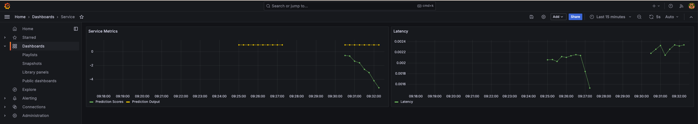

# Anamoly Detection Project

- [Anamoly Detection Project](#anamoly-detection-project)
  - [Context](#context)
  - [Part I - Making a Service](#part-i---making-a-service)
    - [How To Run Notebook](#how-to-run-notebook)
    - [How to Run Service](#how-to-run-service)
      - [Sample cURL commands](#sample-curl-commands)
      - [Using Python Requests](#using-python-requests)
  - [Part II - Monitoring](#part-ii---monitoring)
  - [Next Steps](#next-steps)

## Context

This is a small docker project meant to build and run an anomaly detection algorithm on sample data. It's more a learning project that combines a number of technologies, such as:

- [Grafana](https://grafana.com/)
- [Prometheus](https://prometheus.io/)
- [FastAPI](https://fastapi.tiangolo.com/)
- [Make](https://www.docker.com/blog/containerizing-test-tooling-creating-your-dockerfile-and-makefile/)
- [Docker Compose](https://docs.docker.com/compose/)

To setup a hosted service and monitor traffic.

## Part I - Making a Service

In the first part of this project, we use Make to compile `docker` commands. This made it a little easier to test the Notebook and Endpoint service without rewriting the same docker commands over and over again [Makefile](Makefile)

### How To Run Notebook

Hosts the (*very simple*) Anomaly Detection algorithm training script. [Anomaly Training](notebooks/anomaly_training.ipynb) holds the code for building the Isolation Forest model and savings it.

To build and run the docker container:

```make
make build && make run_notebook
```

With the service up and running, it should print out the url for Notebook session

To stop the docker container

```make
make stop_notebook
```

### How to Run Service

Hosts the FastAPI endpoint for sending `predict` requests to the model

To build and run the docker container:

```make
make build && make run_service
```

To stop the docker container

```make
make stop_service
```

#### Sample cURL commands

Example cURL commands as output from FastAPI

```zsh
# score = false
curl -X 'POST' \
  'http://0.0.0.0:8000/prediction?score=false' \
  -H 'accept: application/json' \
  -H 'Content-Type: application/json' \
  -d '[
  0.1, 0.1
]'


# score = true
curl -X 'POST' \
  'http://0.0.0.0:8000/prediction?score=true' \
  -H 'accept: application/json' \
  -H 'Content-Type: application/json' \
  -d '[
  0.1, 0.1
]'


# GET command
curl -X 'GET' \
  'http://0.0.0.0:8000/model_information' \
  -H 'accept: application/json'
```

#### Using Python Requests

You can also use the requests library, [tester.py](tester.py), to query the endpoint

## Part II - Monitoring

The second part of this project was to setup a Prometheus + Grafana dashboard to monitor traffic to the service.



This time, instead of Make, we use [docker-compose](monitor/docker-compose.yml), to setup prometheus, grafana, and caddy (used to handle basic authentication between both services)

To setup all the services: `cd monitor && docker compose up -d`

Tear them down when done, `docker compose down`

## Next Steps

This was a very introductory projects. The model is very simple, the service only handles a single type of request, and the monitoring is basic (and has no alerting).

In terms of next steps, this project would be a good starting point to build more complex versions of:

- Anomaly Detection models
- Grafana Dashboard + Prometheus Alerting
- Deploying Service to hosted or cloud service
